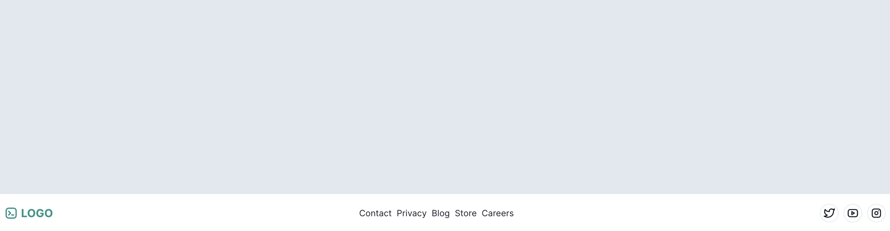

## My Component Library

This is a collection of some React components and UI elements that I use often. Most of them are styled using [`TailwindCSS`](https://tailwindcss.com/).

To use a component, copy the code from `./src/components/<component-dir>/<component-name>.tsx` to your project.  

### Buttons 

##### ColorSchemeToggle

*April 7, 2023*

- [x] Mobile responsive
- [x] Toggle color mode

### Cards 

##### AirbnbCard

*April 6, 2023*

- [x] Mobile responsive
- [x] Toggle color mode

##### SocialMediaCard

*April 6, 2023*

- [x] Mobile responsive
- [x] Toggle color mode

### Footers 

##### FooterCenteredLinks

*April 16, 2023*

- [x] Mobile responsive
- [ ] Toggle color mode

### Forms 

##### SimpleCart

*April 5, 2023*

- [x] Mobile responsive
- [x] Toggle color mode

### Heros 

##### HeroImageReviews

*April 11, 2023*

- [x] Mobile responsive
- [ ] Toggle color mode

### Layouts 

##### HolyGrail

*April 6, 2023*

- [ ] Mobile responsive
- [ ] Toggle color mode

### Navbars 

##### NavbarDividedHorizontal

*April 10, 2023*

- [ ] Mobile responsive
- [ ] Toggle color mode

##### NavbarDividedVertical

*April 9, 2023*

- [ ] Mobile responsive
- [x] Toggle color mode

##### NavbarDrawer

*April 6, 2023*

- [x] Mobile responsive
- [x] Toggle color mode

##### NavbarLogoBtns

*April 6, 2023*

- [ ] Mobile responsive
- [ ] Toggle color mode

