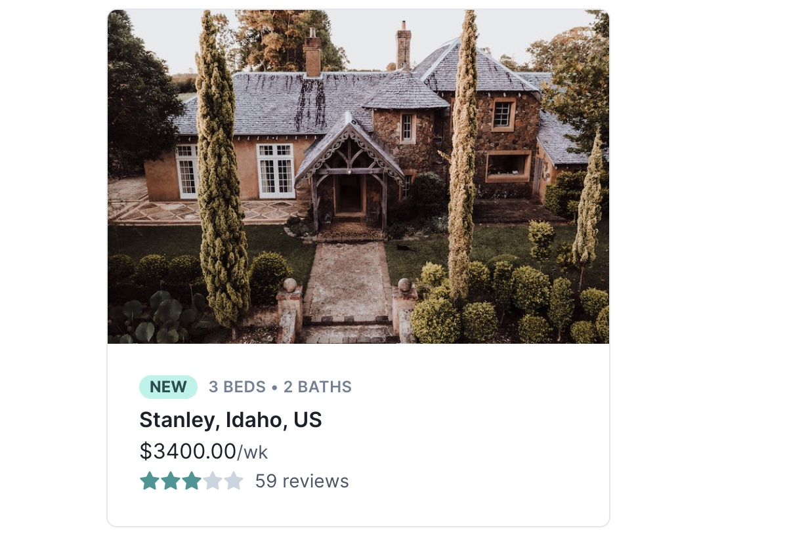
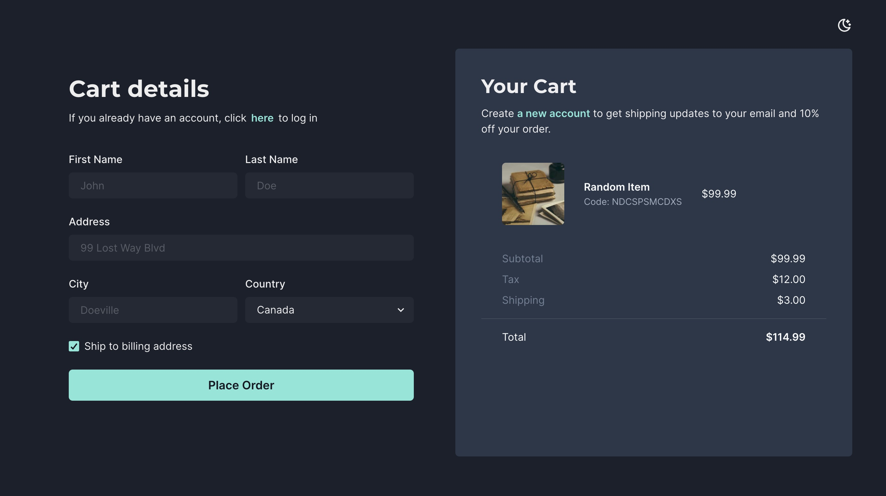

## My Component Library

Language: `TypeScript`

Framework: `NextJS`/`ReactJS`

Styling/UI: `Chakra`

To use a component, copy the code from `./src/components/<component-dir>/<component-name>` to your project. If it is a Javascript project, delete the type definitions. For example:
```sh
type ShowcaseItemProps = {
  componentName: string;
  mobileResponsive: boolean;
  darkModeToggle: boolean;
};

export const ShowcaseItem: React.FC<ShowcaseItemProps> = ({
  componentName,
  mobileResponsive,
  darkModeToggle,
}) => {
  return (..)
```
becomes
```sh
export const ShowcaseItem = ({
  componentName,
  mobileResponsive,
  darkModeToggle,
}) => {
  return (..)
```

### Cards 

##### AirbnbCard
- [x] Mobile responsive
- [x] Toggle color mode



### Forms 

##### SimpleCart
- [x] Mobile responsive
- [x] Toggle color mode


