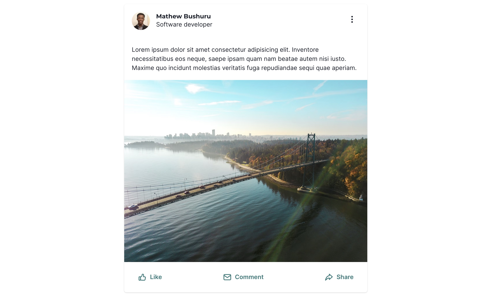
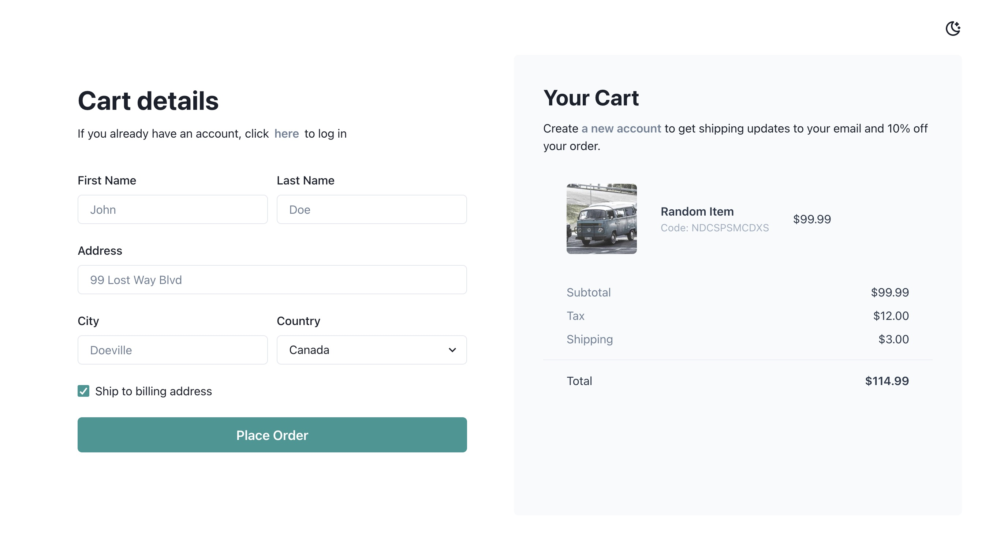
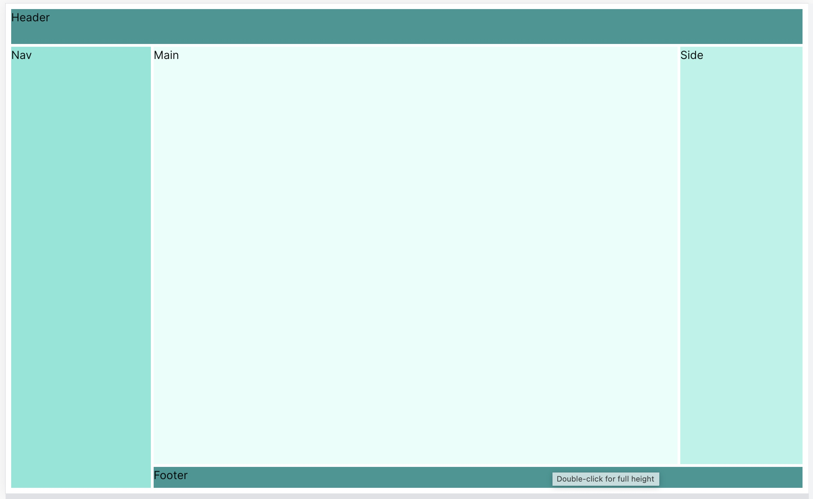
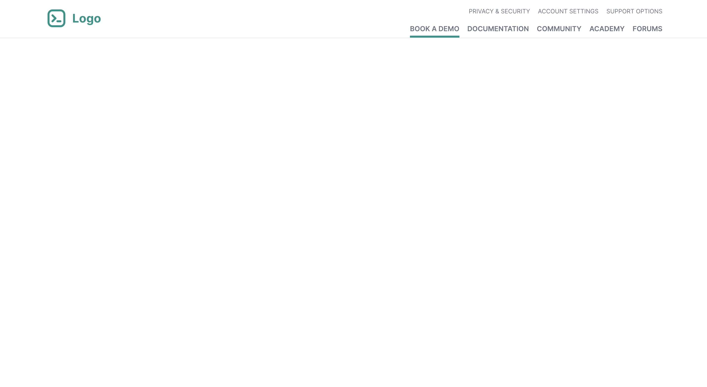
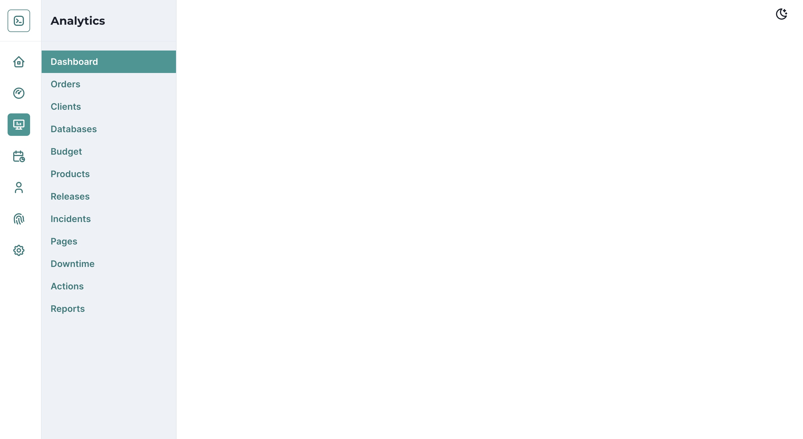
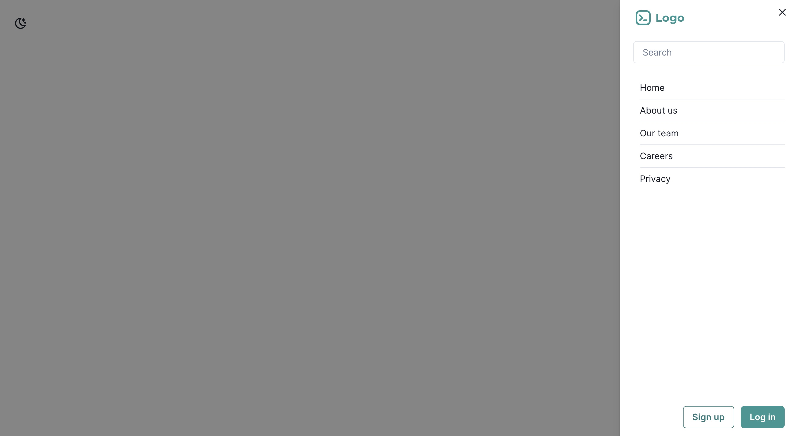

## My Component Library

This is a collection of some React components and UI elements that I use often. They are styled using either [`TailwindCSS`](https://tailwindcss.com/) , [`ChakraUI`](https://chakra-ui.com/) or my own custom CSS.

To use a component, copy the code from `./src/components/<component-dir>/<component-name>` to your project.  

### Buttons 

##### ColorSchemeToggle

*`Chakra`*

*April 7, 2023*

- [x] Mobile responsive
- [x] Toggle color mode

### Cards 

##### AirbnbCard

*`Chakra`*

*April 6, 2023*

- [x] Mobile responsive
- [x] Toggle color mode

##### SocialMediaCard

*`Chakra`*

*April 6, 2023*

- [x] Mobile responsive
- [x] Toggle color mode

### Footers 

##### FooterCenteredLinks

*`Tailwind`*

*April 16, 2023*

- [x] Mobile responsive
- [ ] Toggle color mode

### Forms 

##### SimpleCart

*`Chakra`*

*April 5, 2023*

- [x] Mobile responsive
- [x] Toggle color mode

### Heros 

##### HeroImageReviews

*`Tailwind`*

*April 11, 2023*

- [x] Mobile responsive
- [ ] Toggle color mode

### Layouts 

##### HolyGrail

*`Chakra`*

*April 6, 2023*

- [ ] Mobile responsive
- [ ] Toggle color mode

### Navbars 

##### NavbarDividedHorizontal

*`Tailwind`*

*April 10, 2023*

- [ ] Mobile responsive
- [ ] Toggle color mode

##### NavbarDividedVertical

*`Chakra`*

*April 9, 2023*

- [ ] Mobile responsive
- [x] Toggle color mode

##### NavbarDrawer

*`Chakra`*

*April 6, 2023*

- [x] Mobile responsive
- [x] Toggle color mode

##### NavbarLogoBtns

*`Chakra`*

*April 6, 2023*

- [ ] Mobile responsive
- [ ] Toggle color mode

